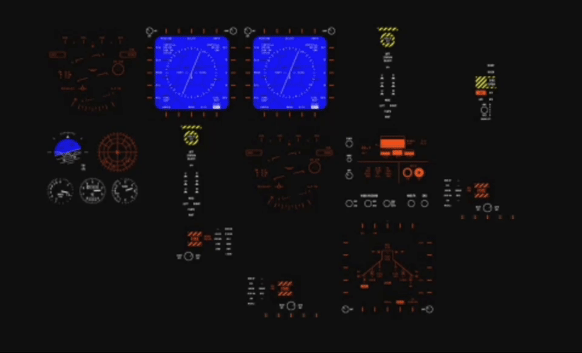

# Entropic Mosaic

<!-- Meilleur nom. Entropic Tiles? mosaique tesselle entropics isentropic entro-pic-->

Experimenting with AI to create mosaics.

<!-- optionally-parameterized, random, interactive -->

## Usage

Open any `index.html` in the `Tilesets` folder to load a mosaic.
Refresh the page, hover an individual tile or click it to update the mosaic.

<!-- ## Available Tilesets

liste illustrée( et commentée si comportement ou prompt intéressant de code ou d'image)

 (en gif tiens)
quick PoC
find source

 -->

## Methodology

Mosaics are made of two components, both AI-generated:

1. An HTML file handling the logic and display of tile, through inline JS/CSS
2. The associated collection of tiles

HTML files are generated by ChatGPT after this sort of prompt:

>Please create, in javascript, a 5*5 grid of 80px tiles of tiles using SVG images from an `assets` folder.
The images should be loaded randomly. Clicking or hovering any tile should update it randomly.
The grid should be wrapped in a div whose width and height can be easily specified with % or px. Round the corners of the grid to 8px.

<!-- if a significantly different prompt was used, it's captured next to the resulting html -->

Tiles are generated in Midjourney then slightly edited by hand in Figma. The simpler ones are created directly in Figma.

<!-- make Figma public, link to it -->
